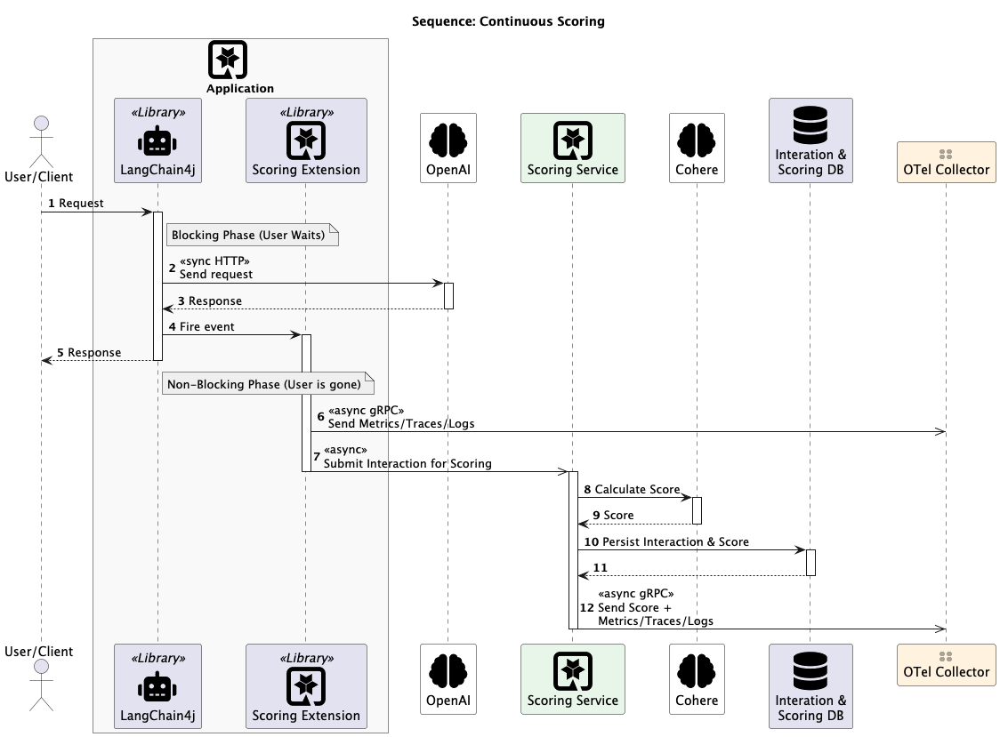
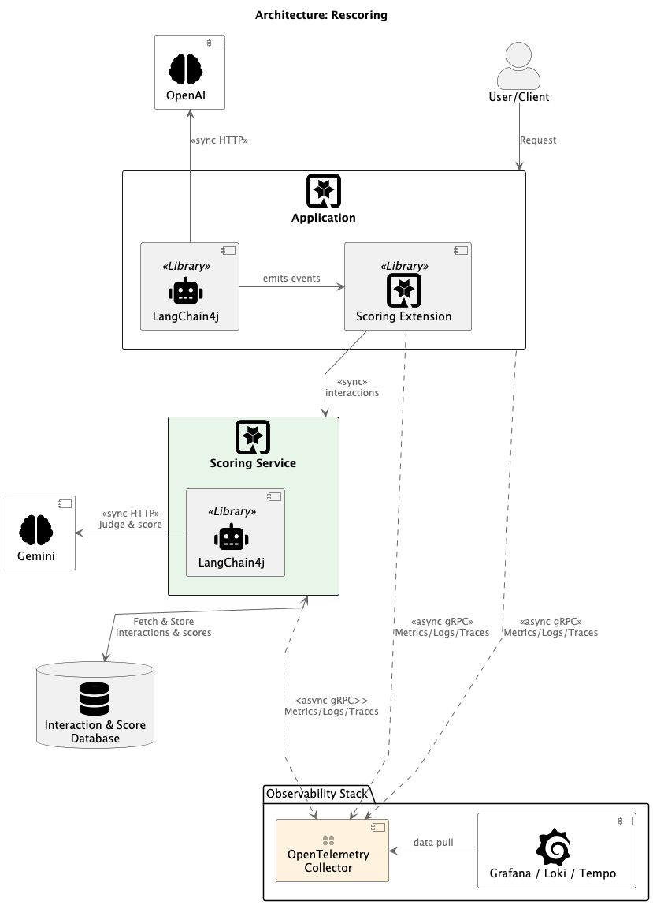
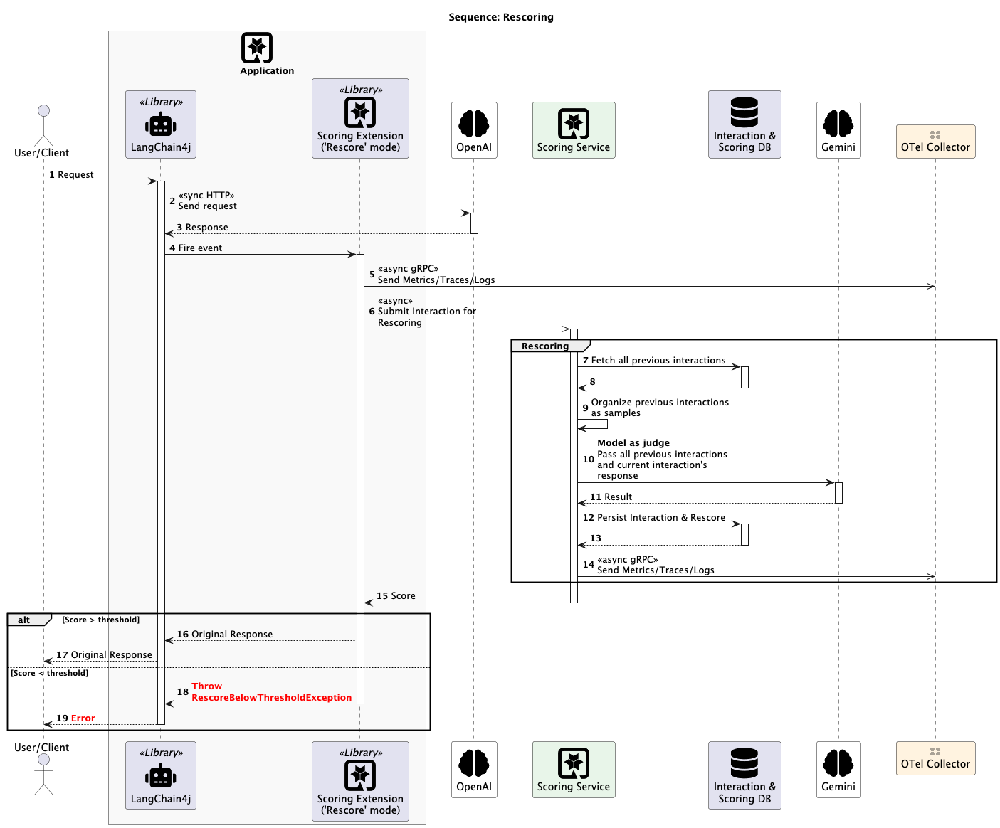

This repo has 2 main folders:
- [parasol-app](parasol-app)
    - The main Parasol Insurance application
- [ai-scorer](ai-scorer)
    - The scoring app

## Langfuse integration

Things that can't yet be done programmatically:
- Configuring evaluators (see https://github.com/orgs/langfuse/discussions/8241)

What you CAN auto-configure via LANGFUSE_INIT_* env vars:          
  - Online Evaluators (LLM-as-a-Judge) — must be set up manually in the LangFuse UI                           
Workaround if you want fully automated scoring:
- Build an external evaluation pipeline — compute scores in your code and push them to LangFuse via POST `/api/public/scores`. This is what ai-scorer essentially does today, just targeting LangFuse's API instead of its own PostgreSQL. 

## Continuous Scoring

## Rescoring

