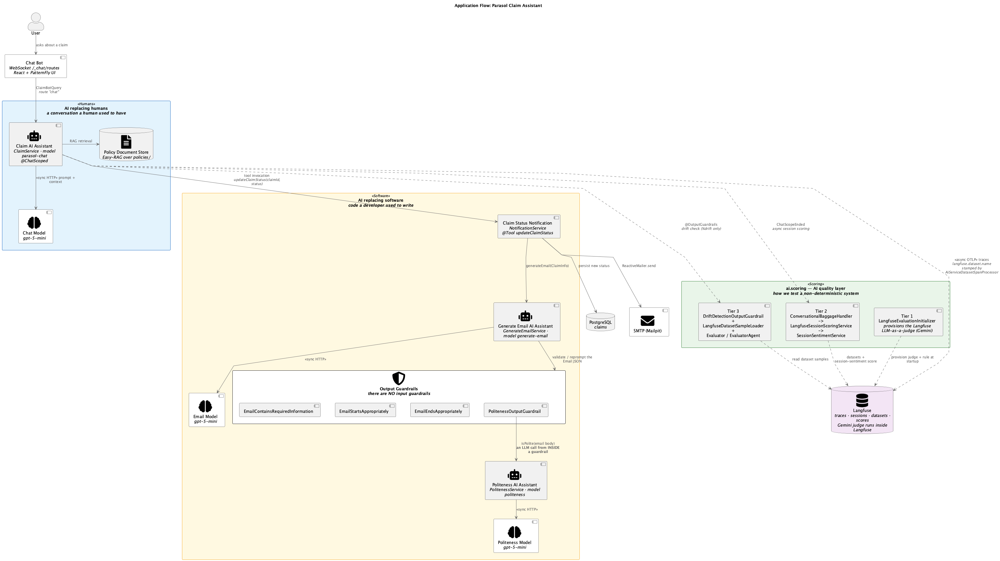

# Non-Deterministic? No Problem!

A demo application — Parasol Insurance — showing how to test and continuously evaluate
non-deterministic AI systems.

It is a single [Quarkus](https://quarkus.io) application (Java 25) with a React/PatternFly frontend
served by [Quinoa](https://docs.quarkiverse.io/quarkus-quinoa/dev/). The business app itself is
deliberately small; the interesting part is the three-tier AI evaluation strategy built on top of
[Langfuse](https://langfuse.com) via the
[quarkus-langfuse](https://github.com/quarkiverse/quarkus-langfuse) extension.

## What it demonstrates

- **An AI chat bot doing RAG** — `ClaimService` (model `parasol-chat`) answers questions about an
  insurance claim, augmented by Easy RAG over a policy PDF
  (`src/main/resources/policies/policy-info.pdf`). Chat runs over a WebSocket (`/_chat/routes`,
  route `chat`), not REST.
- **An LLM tool call with real side effects** — the model may call
  `NotificationService.updateClaimStatus`, which updates the claim in PostgreSQL and then asks a
  second AI service (`generate-email`) to compose a notification email that is actually sent.
- **Output guardrails, including one that calls another LLM** — the generated email passes through
  four output guardrails; the last of them (`PolitenessOutputGuardrail`) delegates to
  `PolitenessService`, an AI service of its own. There are seven guardrail classes in total, all on
  the output side — this app has no input guardrails.
- **Three tiers of continuous AI evaluation** — per-trace judging inside Langfuse, session-level
  scoring written in application code, and drift detection wired into a guardrail.

## Architecture


The hand-drawn overview of the business flow, framed around the question this demo keeps asking of
every box: is it "code I write" or is it "is this code?".



The same flow rendered in detail, adding the `ai.scoring` evaluation layer the overview omits: the
browser opens a chat WebSocket, `ClaimService` answers using RAG plus the chat model, and — when the
conversation warrants it — issues a tool call to `NotificationService`, which updates the claim and
hands off to `GenerateEmailService`. The generated email runs the gauntlet of the four output
guardrails before `ReactiveMailer` sends it.

Two further diagrams cover the evaluation layer:

- [`docs/continuous-scoring-architecture.png`](docs/continuous-scoring-architecture.png) — component
  view of the single Quarkus container, showing the `org.parasol` business layer, the `ai.scoring`
  evaluation layer, the three tiers, and the external systems.
- [`docs/continuous-scoring-sequence.png`](docs/continuous-scoring-sequence.png) — sequence diagram
  of tier-2 session scoring, from `ChatScopeEnded` through the OpenTelemetry flush wait and
  observation polling to the score written back to Langfuse.

The three PlantUML diagrams are generated with [PlantUML](https://plantuml.com) from the `.puml` sources
committed next to them in `docs/`. Re-render them with
[`docs/render-diagrams.sh`](docs/render-diagrams.sh) (needs Java and Graphviz; it downloads the
pinned PlantUML release into a temp directory on first use).

## The three evaluation tiers

| Tier | What | Where it runs | Active when |
|---|---|---|---|
| 1 — per-trace | Langfuse-native LLM-as-a-judge relevance evaluator, provisioned at startup by `LangfuseEvaluationInitializer` | Inside Langfuse, using Gemini. The application never calls Gemini itself — it only registers the LLM connection | `quarkus.aiscoring.langfuse.evaluation.initialize-on-startup` (default `true`) |
| 2 — session-level | Custom code: when the chat scope ends, the conversation's observations are pulled back from Langfuse, turned into dataset items, and scored for sentiment. Langfuse has no session-level evaluation target, so this tier exists entirely in application code | In the app, on a background thread (`LangfuseSessionScoringService`) | `quarkus.aiscoring.langfuse.evaluation.session.score-session` (default `true`) |
| 3 — drift detection | `DriftDetectionOutputGuardrail` replays past dataset samples through the `quarkus-langchain4j` evaluation framework and fails the response if the pass rate drops below the threshold | In the app, inline in the guardrail | `quarkus.aiscoring.interaction-mode: drift-detection` |

**Non-obvious:** tiers 2 and 3 are mutually exclusive in practice. `%drift` is the only profile that
arms tier 3, and it inherits `%langfuse-ocp`, which sets `score-session: false` — so when drift
detection is on, session scoring is off.

The full rationale, including which Langfuse platform gaps drove each tier, is in
[langfuse-evaluation.md](langfuse-evaluation.md).

## Prerequisites

- **Java 25**
- **Maven** — use the included wrapper (`./mvnw`); no separate install needed
- **A container runtime** (Docker or Podman). The Quarkus extensions on the classpath start Dev
  Services for PostgreSQL, Langfuse, Mailpit and LGTM (Grafana/Loki/Tempo/Mimir) automatically in
  dev and test mode
- **API keys**, depending on what you want to exercise:

| Variable | Needed for |
|---|---|
| `OPENAI_API_KEY` | The `parasol-chat`, `generate-email` and `politeness` models, plus the Easy RAG embedding model |
| `COHERE_API_KEY` | The `session-sentiment` and `judge` models, reached through Cohere's OpenAI-compatible endpoint at `https://api.cohere.ai/compatibility/v1` |
| `GEMINI_API_KEY` | Only when `LangfuseEvaluationInitializer` runs. A *missing* key raises an `IllegalStateException` that is deliberately rethrown and aborts boot; other failures reaching Langfuse (`LangfuseApiException` or anything else) are caught and logged as warnings so startup continues |

Under `-Pollama` the OpenAI and Cohere keys are stubbed to `changeme`, so neither is required.
Under `-Pollama-openai` no keys are stubbed: `session-sentiment` and `judge` still talk to Cohere,
so `COHERE_API_KEY` is still needed if you exercise them (see below).

## Quickstart

```shell
./mvnw quarkus:dev
```

Then:

- **Application**: http://localhost:8080
- **Swagger UI**: http://localhost:8080/q/swagger-ui (always included, even outside dev mode)
- **Quarkus Dev UI**: http://localhost:8080/q/dev-ui

Dev Services bring up PostgreSQL, Langfuse, Mailpit and LGTM for you automatically. The
application does not
override `quarkus.http.port` anywhere, so it uses the Quarkus default of `8080` in dev mode. Tests
run against port `8081` — the root `pom.xml` sets `BACKEND_API_URL=http://localhost:8081/api` for
both surefire and failsafe.

The only REST endpoints are `GET /api/db/claims` and `GET /api/db/claims/{id}`; everything else goes
through the chat WebSocket.

# Langfuse integration

Langfuse's own `LANGFUSE_INIT_*` environment variables cover only basic bootstrapping (org, project,
user, API keys). They do **not** cover evaluators, so at one point these had to be created by hand in
the Langfuse UI (see https://github.com/orgs/langfuse/discussions/8241).

That is no longer the case here. `ai.scoring.langfuse.init.LangfuseEvaluationInitializer` provisions
everything on application startup through the `LangfuseOperations` layer of the
[quarkus-langfuse](https://github.com/quarkiverse/quarkus-langfuse) extension, gated on
`quarkus.aiscoring.langfuse.evaluation.initialize-on-startup` (default `true`). On a `StartupEvent`
it creates-or-reuses:

- a score config for session sentiment
- a Cohere model definition
- a Google AI Studio (Gemini) LLM connection, using `GEMINI_API_KEY`
- a score config for continuous evaluation
- the `Continuous Evaluation Evaluator` LLM-as-a-Judge evaluator
- an evaluation rule binding that evaluator to incoming traces (100% sampling, excluding `SPAN` and
  `EVENT` observation types)

Each step is idempotent — existing entities are looked up by name and reused. That is now the
extension's job: `createIfAbsent` (and `upsert` for the LLM connection) replaced the hand-written
lookup-then-create code this app used to carry. The one call that still drops to the raw
`langfuse.api()` client is re-pointing an existing evaluator at the configured model, because the
operations layer has no `update` for evaluators. Failures are logged as warnings rather than
aborting startup.

For the evaluation gaps that genuinely *can't* be solved through Langfuse today (session-level
scoring, experiment orchestration from Java) and the workarounds implemented in this project, see
[langfuse-evaluation.md](langfuse-evaluation.md).

# Using Ollama

If you would like to use [Ollama](https://ollama.com/) instead, first install/run Ollama on your
machine. Then add `-Pollama` to any Maven command (or `-Dollama` when using the Quarkus CLI):

| Task | Maven | Quarkus CLI |
|---|---|---|
| Building the app | `./mvnw clean package -DskipTests -Pollama` | `quarkus build --clean --no-tests -Dollama` |
| Running dev mode | `./mvnw quarkus:dev -Pollama` | `quarkus dev -Dollama` |
| Running tests | `./mvnw verify -Pollama` | `quarkus build --tests -Dollama` |

To run the app outside dev mode, build it as described above, then run:

```shell
java -Dquarkus.profile=ollama,prod -jar target/quarkus-app/quarkus-run.jar
```

# Using Ollama via the OpenAI endpoint

If you would like to use [Ollama](https://ollama.com/) instead but using the OpenAI endpoint, first
install/run Ollama on your machine. Then use `-Pollama-openai` (or `-Dollama-openai` with the
Quarkus CLI):

| Task | Maven | Quarkus CLI |
|---|---|---|
| Building the app | `./mvnw clean package -DskipTests -Pollama-openai` | `quarkus build --clean --no-tests -Dollama-openai` |
| Running dev mode | `./mvnw quarkus:dev -Pollama-openai` | `quarkus dev -Dollama-openai` |
| Running tests | `./mvnw verify -Pollama-openai` | `quarkus build --tests -Dollama-openai` |

To run the app outside dev mode, build it as described above, then run:

```shell
java -Dquarkus.profile=ollama-openai,prod -jar target/quarkus-app/quarkus-run.jar
```

Both Ollama profiles redirect only the three business chat models — `parasol-chat`,
`generate-email`, `politeness` — plus the embedding model to a local Ollama (`llama3.2:latest` and
`snowflake-arctic-embed` respectively). The two Cohere-backed models, `session-sentiment` and
`judge`, are **not** redirected: they keep the OpenAI provider pointed at
`https://api.cohere.ai/compatibility/v1`.

The two profiles differ in what else they touch:

- `%ollama` switches those four to `provider: ollama`, stubs `api-key: changeme` for the OpenAI
  client and for `session-sentiment` and `judge`, and turns off both `score-session` and
  `initialize-on-startup`.
- `%ollama-openai` keeps the OpenAI client and just repoints the same four at
  `http://localhost:11434/v1`. It stubs no API key and disables neither session scoring nor the
  startup initialization.

CI runs `./mvnw -B clean verify` across both profiles with only a stubbed
`OPENAI_API_KEY: change-me`. That works because `verify` activates the `%test` profile, which is
where `score-session: false` and `initialize-on-startup: false` come from — not from the Ollama
profiles.

# Further reading

- [CLAUDE.md](CLAUDE.md) — deep project context: architecture, build/test commands, configuration
  profiles and the gotchas that bite.
- [langfuse-evaluation.md](langfuse-evaluation.md) — the three-tier evaluation design, the Langfuse
  platform gaps behind it and the workarounds chosen.