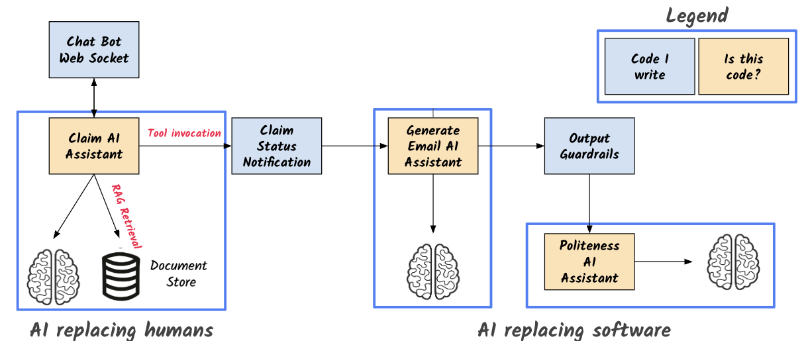

# Non-Deterministic? No Problem!

This project is a Quarkus demo application for testing and observing
non-deterministic AI systems. It presents a fictional Parasol Insurance claims
application whose AI assistant can:

- answer questions about a claim using retrieval-augmented generation (RAG);
- update a claim through a tool invocation;
- generate a claimant notification email; and
- validate generated email content with deterministic and AI-powered output
  guardrails.

The application also demonstrates continuous scoring, session-level sentiment
scoring, and drift detection with [Langfuse](https://langfuse.com/).

## Architecture



The React and PatternFly frontend communicates with the Quarkus backend through
REST endpoints and a WebSocket chat route. The backend uses PostgreSQL for claim
data, Mailpit for development email delivery, and Langfuse for traces, datasets,
and evaluation scores.

The main AI flow is:

1. The claim assistant answers questions using the claim context and policy
   documents under `src/main/resources/policies/`.
2. When asked to change claim status, it invokes the notification tool.
3. The notification tool updates the claim, generates an email, validates the
   email with output guardrails, and sends it.
4. LangChain4j telemetry is exported to Langfuse for evaluation and analysis.

## Prerequisites

- JDK 21 or newer
- A Docker- or Podman-compatible container runtime for Quarkus Dev Services
- An `OPENAI_API_KEY` and `COHERE_API_KEY` for the default configuration

The Maven wrapper installs the configured Node.js and npm versions when it
builds the frontend, so a separate Node.js installation is not required for the
standard Maven workflow.

## Run with OpenAI and Cohere

Export the required API keys:

```bash
export OPENAI_API_KEY=your-openai-api-key
export COHERE_API_KEY=your-cohere-api-key
```

Start the application in development mode:

```bash
./mvnw quarkus:dev
```

Open <http://localhost:8080/> and select a claim to chat with the Parasol
Assistant. Quarkus Dev Services starts the development dependencies, including
PostgreSQL, Mailpit, the LGTM observability stack, and Langfuse.

The Quarkus Dev UI is available at <http://localhost:8080/q/dev-ui/>.

## Run with Ollama

Install and start [Ollama](https://ollama.com/). The configured chat and
embedding models are `llama3.2:latest` and `snowflake-arctic-embed`.

Use the native Ollama provider:

```bash
./mvnw -Pollama quarkus:dev
```

Or use Ollama's OpenAI-compatible endpoint:

```bash
./mvnw -Pollama-openai quarkus:dev
```

The `ollama` profile runs all configured chat and embedding models locally, so
cloud API keys are not required. The `ollama-openai` profile routes the claim
assistant, email generation, politeness check, and embeddings through Ollama's
OpenAI-compatible API; session sentiment and evaluator setup retain their
Cohere configuration and therefore require `COHERE_API_KEY`.

## Build and test

Run the unit tests:

```bash
./mvnw test
```

Run the complete verification lifecycle:

```bash
./mvnw verify
```

The same commands support either local model profile:

```bash
./mvnw -Pollama verify
./mvnw -Pollama-openai verify
```

Build the application without running tests:

```bash
./mvnw clean package -DskipTests
```

Run the packaged application:

```bash
java -jar target/quarkus-app/quarkus-run.jar
```

For an Ollama production build, select the profile while packaging:

```bash
./mvnw clean package -DskipTests -Pollama
java -Dquarkus.profile=ollama,prod -jar target/quarkus-app/quarkus-run.jar
```

## AI evaluation

The application implements three complementary evaluation paths:

| Evaluation | When it runs | Behavior |
| --- | --- | --- |
| Continuous scoring | After traced AI interactions | A Langfuse LLM-as-a-judge evaluator scores individual generations. The application creates the model definition, connection, evaluator, score configuration, and evaluation rule at startup when they do not already exist. |
| Session scoring | When a chat session closes | The application evaluates overall conversation sentiment, records a session score, and can add exchanges to Langfuse datasets. |
| Drift detection | During drift-profile tests or runs | The output guardrail compares a new response with the corresponding Langfuse dataset and rejects responses below `quarkus.aiscoring.threshold` (default `0.75`). |

Run the drift-detection tests with:

```bash
./mvnw test -Dtest=DriftDetectionTests
```

See [Langfuse Evaluation Strategy](langfuse-evaluation.md) for the design,
platform limitations, and alternative evaluation approaches.

## Frontend development

Quarkus normally installs and builds the frontend in `src/main/webui/` through
Quinoa. To work on it independently, start the backend and then run:

```bash
cd src/main/webui
npm ci
BACKEND_API_URL=http://localhost:8080/api npm run start:dev
```

The standalone development server listens on <http://localhost:8006/> by
default. See the [frontend README](src/main/webui/README.md) for all supported
scripts.

## OpenShift deployment

`deploy-to-openshift.sh` installs Langfuse with Helm, creates the application
secret from `OPENAI_API_KEY` and `COHERE_API_KEY`, deploys the supporting
resources, and builds the application with the `openshift` profile.

Before running it, log in with `oc`, select the target project, authenticate
Helm to the cluster as needed, and export both API keys:

```bash
./deploy-to-openshift.sh
```
