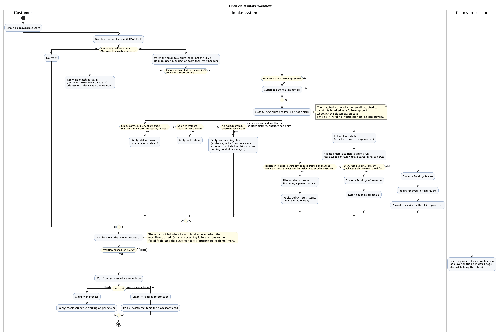
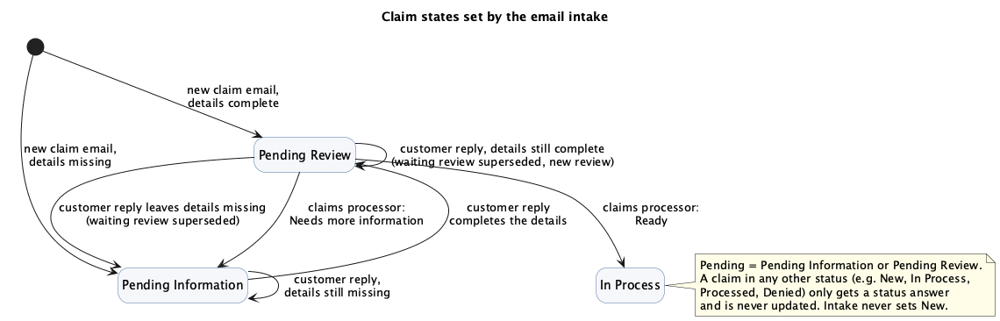
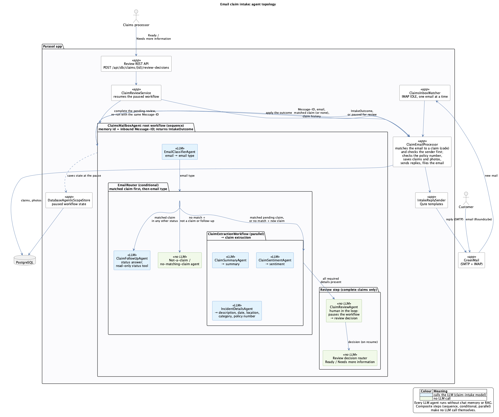

# Design: email claim intake

Status: proposed, for review before implementation ([#216](https://github.com/edeandrea/non-deterministic-no-problem/issues/216)).

## Goal

Customers open a claim by emailing `claims@parasol.com`. The **intake system** classifies each email,
extracts the details, asks the **customer** for anything missing and updates the claim as replies
arrive. A **claims processor** then does one last completeness look-over (not an approval).
The existing chat (`ClaimService`), `NotificationService` and `GenerateEmailService` stay unchanged,
apart from the email sign-off shared with the new templates. Out of scope: non-English email, several
incidents in one email, the reviewer editing extracted fields, and drift detection for the new agents.

The prerequisites are [#212](https://github.com/edeandrea/non-deterministic-no-problem/issues/212) (dependency upgrades), [#213](https://github.com/edeandrea/non-deterministic-no-problem/issues/213) (claim data model), [#214](https://github.com/edeandrea/non-deterministic-no-problem/issues/214) (claim images) and [#215](https://github.com/edeandrea/non-deterministic-no-problem/issues/215)
(GreenMail and Roundcube). Progress is tracked in [#217](https://github.com/edeandrea/non-deterministic-no-problem/issues/217).

## Workflow

A claim is **pending** while it is `Pending Information` or `Pending Review`.

1. A watcher (IMAP IDLE) receives the email; emails are processed one at a time.
2. Auto-replies, self-sent mail and duplicates (same `Message-ID`) are filed without a reply.
3. Code (not the LLM) matches the email to a claim: a claim number in the subject or body, then the
   reply headers. Only the claim's own email address may match it; anyone else gets the "no matching
   claim" reply, which gives no details and asks them to write from the claim's address or include
   the claim number. A reply to a `Pending Review` claim supersedes the waiting review.
4. The email is classified as a new claim, a follow-up or not a claim. **The matched claim wins:** a
   matched email is a follow-up on that claim, whatever the label. Without a match the label decides;
   an unmatched "follow-up" gets the "no matching claim" reply, and nothing is created or changed.
5. A matched claim in any other status (e.g. `New`, `In Process`, `Processed`, `Denied`) gets a status
   answer. For a matched pending claim, or an unmatched new claim, the details are extracted over the
   whole correspondence: what happened, incident date, location and category (`Other` counts).
6. When the agents finish (a complete claim's run has already paused for review, state saved), the
   processor applies the policy-number rule in code, before any claim is created or changed. If a
   stated number belongs to another customer, it discards the run state, including a paused review,
   and sends a vague "policy inconsistency" reply; no claim and no review exist.
7. If anything is missing, the claim is `Pending Information` and the customer is asked for exactly
   those items. Each reply starts again at step 1.
8. When nothing is missing, the claim is `Pending Review`, the customer is told it's received and in
   final review, and the paused run waits. Its state is saved in PostgreSQL, so it survives restarts.
9. The email is filed when its run finishes, including when it pauses, and the watcher moves on. If
   processing fails, the email goes to a failed folder and the customer gets a "processing problem" reply.
10. Later, and separately, the claims processor decides on the claim detail page, and the workflow
    resumes. **Ready** → `In Process` and a thank-you email. **Needs more information** (ticking items)
    → `Pending Information` and an email listing exactly those items; the claim stays incomplete until
    the customer answers them, so an empty reply doesn't go straight back to review.

Every submission gets a reply (fixed templates, except the AI-written status answer), apart from
auto-replies, self-sent mail and duplicates.

## Claim states

| From | Trigger | To |
|---|---|---|
| (new) | New claim email with details missing | `Pending Information` |
| (new) | New claim email with every detail present | `Pending Review` |
| `Pending Information` | Customer reply, details still missing | `Pending Information` |
| `Pending Information` | Customer reply completes the details | `Pending Review` |
| `Pending Review` | Customer reply, details still complete: the waiting review is superseded by a new one | `Pending Review` |
| `Pending Review` | Customer reply leaves details missing: the waiting review is superseded | `Pending Information` |
| `Pending Review` | Claims processor: Needs more information | `Pending Information` |
| `Pending Review` | Claims processor: Ready | `In Process` |

Claims in any other status (e.g. `New`, `In Process`, `Processed`, `Denied`) only get a status answer
and are never updated. Intake never sets `New`.

## Agent architecture

`ClaimEmailProcessor` matches the claim and checks the sender, then calls the root workflow
`ClaimsMailboxAgent` with the matched claim (or none). Its memory id is the inbound `Message-ID`. It
runs three steps in sequence:

- `EmailClassifierAgent` (LLM) returns the email type.
- `EmailRouter` (no LLM) routes on the matched claim first, then on the type:
  - matched pending claims, and unmatched new claims, go to `ClaimExtractionWorkflow`: three LLM agents
    in parallel, `ClaimSummaryAgent`, `ClaimSentimentAgent` and `IncidentDetailsAgent` (description,
    date, location, category, stated policy number).
  - matched claims in any other status go to `ClaimFollowUpAgent` (LLM), which writes the status
    answer using a read-only status tool.
  - unmatched "not a claim" and "follow-up" emails go to a non-LLM agent for those two outcomes.
- When every required detail is present, `ClaimReviewAgent` (non-LLM, human in the loop) pauses the
  workflow without blocking a thread; `DatabaseAgenticScopeStore` saves the state.

The decision (`POST /api/db/claims/{id}/review-decisions`) goes to `ClaimReviewService`, which
completes the pending review and re-runs the root with the same `Message-ID`. Completed agents are
skipped; a non-LLM router turns the decision into the outcome. The paused state is deleted when the run
ends, a customer reply supersedes the review, or the policy check rejects the claim.

All LLM agents use the `claim-intake` model. Agents only decide, returning an `IntakeOutcome` with no
side effects. `ClaimEmailProcessor` checks the policy number, saves the claim and photos,
sends the reply through `IntakeReplySender`, and files the email. The agents are stateless (no chat
memory, no retrieval over the policy PDF); the processor passes the claim's history (correspondence,
fields extracted so far, items requested) in on every run.

The framework workarounds this design depends on were verified in a throwaway spike for [#216](https://github.com/edeandrea/non-deterministic-no-problem/issues/216); the
findings are summarised in the pull request that introduced this document.
